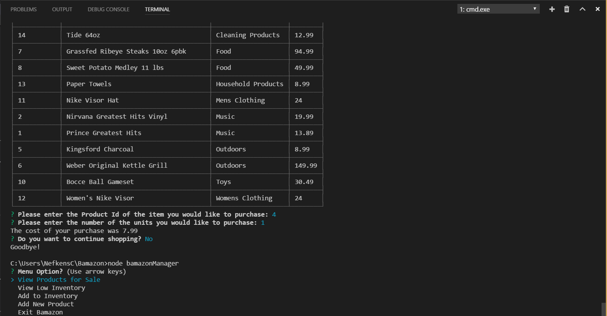
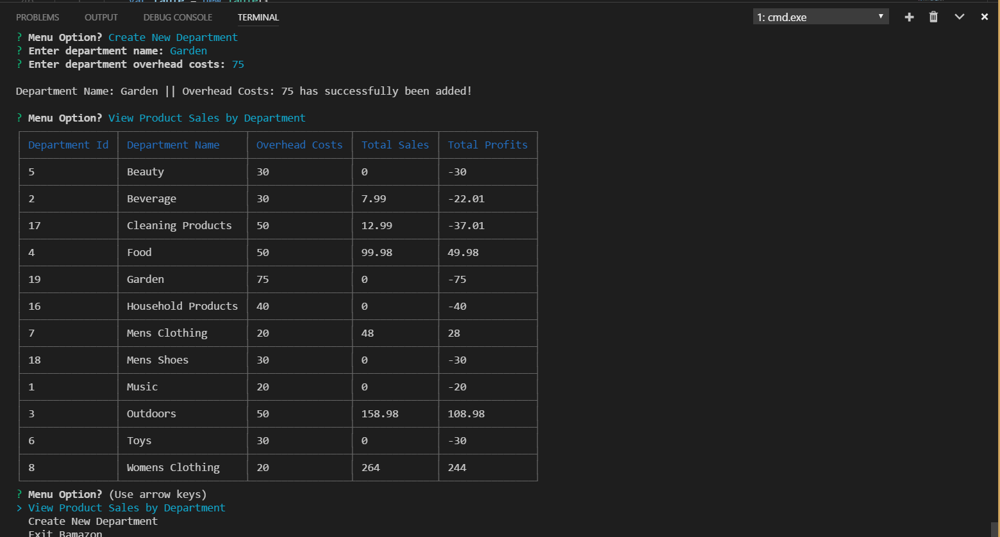

# Bamazon

## Overview

Bamazon is Amazon-like CLI application built using Node and mySQL. It utilizes NPM packages mySQL, Inquirer, and CLI-Table.  The application includes 
three main javascript files with functions related to customers, managers and supervisors. The app will take in orders from customers and 
deplete stock from the store's inventory and update sales figures. Managers can view inventory, check on low inventory items, add inventory 
to existing projucts and add new products. Supervisors can view product sales across the store's departments and then provide a summary of 
the highest-grossing departments in the store.

## Bamazon Files Overview:
The Bamazon application includes a mySQL database named bamazon that contains two tables: products and sales. The database is not included
in the repository. It includes relevant Node NPM packages (mySQL and Inquirer) and package.json file. Bamazon is compried of has 3 javascript
files: bamazonCustom.js, bamazonManager.js, and bamazonSupervisor.js which contain prompts and functions related to customers, managers and
supervisors, respectively. 

## Bamazon Database Overview:
The bamazon database includes two main tables and three views.
The tables are named: products and departments
The views are named: vw_ProductsForSale, vw_LowInventory, and vw_SalesByDepartment

### Tables
1. The products table includes the following columns:

   * item_id (unique id for each product)

   * product_name (Name of product)

   * department_name

   * price (cost to customer)

   * stock_quantity (how much of the product is available in stores) 

   * product_sales (product revenue to date) 

2. The departments table includes the following columns:

   * department_id (unique id for each department)

   * department_name (Name of department)

   * over_head_costs (Department overhead costs)

   * total_sales (Department total sales to date)

## Instructions for use

### Customer Script (bamazonCustomer.js)

1. Running this script will first display all of the items available for sale. Include the ids, names, and prices of products for sale.

2. The app should then prompt the user with two messages.

   * The first should ask them the ID of the product they would like to buy.
   * The second message should ask how many units of the product they would like to buy.

3. Once the customer has placed the order, the script will check if the store has enough of the product to meet the customer's request.

   * If current inventory is insufficient to meet the requested quantity, the app script will log a message indicating 
     `Insufficient quantity on hand!`, and prevent the order from going through.

4. However, if the store does have enough of the product, the user's order will be fulfilled, including.
   * Updating the bamazon SQL database to reflect the remaining quantity. It will aslo update the product_sales field in the products
     table and the total_sales field in the departments table.
   * Once the update goes through, the total cost of the user’s purchase should be displayed and a prompt will appear asking if 
     the customer wants to continue shopping. If customer selects the No option, the script will stop running and console “Goodbye”. 
     Otherwise, the customer can select another item to purchase.

### Manager Script (bamazonManager.js)

1. The `bamazonManager.js` script includes 4 manager related menu options: 

    * View Products for Sale
    * View Low Inventory
    * Add to Inventory
    * Add New Product

2. If a user selects `View Products for Sale`, the script will list every available item: the item IDs, names, prices, and quantities.

3. If a manager selects `View Low Inventory`, then it will list all items with a inventory count lower than five.

4. If a user selects `Add to Inventory`, prompts will appear asking the user which item to increase and by how much. The console will 
display a confirmation after the amount has been added to the item.

   Rerunning The View Products For Sale option will now show the added inventory in the results:

5. If a user selects `Add New Product`, it will allow the manager to add a completely new product to the store. It will prompt the
user for the Product Name, Department, Price and starting inventory. The console will display a confirmation once the item has been added
to the bamazon database.

6. A user can select the `Exit Bamazon` option to exit the bamazonManager.js script

### Supervisor Script (bamazonSupervisor.js)

1. The 'bamazonSupervisor.js` script includes two supervisor related menu options:

   * View Product Sales by Department
   * Create New Department

2. When a user selects the `View Product Sales by Department` option, the console will show deparments sales and profit information
   including Department Id, Department Name, Overhead Costs, Total Sales and Total Profit. Total Profit is dynamically calculated based
   on Total Sales - Overhead Costs.

3. When a user selects the `Create New Department Option', they will receive prompts to enter in the new department name and overhead costs.
   The console will display a confirmation after the department has been added.

  Running the `View Product Sales by Department` option again should display the newly created department:

4. The user can click on the Exit Bamazon option to exit the script.